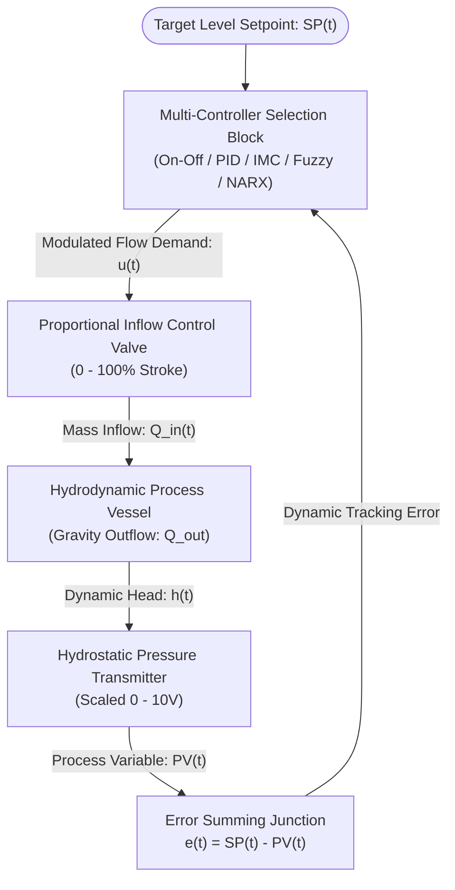

# Hydrodynamic Liquid Level Process Control: Multi-Strategy Digital Twin Benchmark

An advanced industrial process automation and non-linear control framework benchmarking five continuous level regulation strategies on a gravity-drained hydraulic process plant. The system pairs high-level Siemens Structured Control Language (SCL) execution with a Factory I/O 3D digital twin to rigorously analyze transient settling response, disturbance rejection, valve actuation effort, and integrator anti-windup under severe hydrodynamic non-linearities.

---

## Executive Overview & Process Performance KPIs

Hydrostatic level regulation in process vessels exhibits asymmetric non-linearities governed by Torricelli's gravity-driven discharge. While inflow is actively driven by variable-speed pumps or proportional throttling valves, outflow is passively dependent on the square root of the instantaneous hydrostatic head. 

To eliminate steady-state offset and prevent cavitation or overflow, five discrete controller algorithms were programmed in native IEC 61131-3 SCL and benchmarked under identical process disturbance loads:

| Control Strategy | Rise Time ($t_r$) | Settling Time ($t_s \pm 2\%$) | Peak Overshoot ($M_p$) | Steady-State Error ($e_{ss}$) | Computational Footprint |
| :--- | :--- | :--- | :--- | :--- | :--- |
| **On-Off with Hysteresis** | Fast | N/A (Limit Cycle) | $12.4\%$ | $\pm 2.5\text{ cm}$ Band | Minimal ($< 0.1\text{ ms}$) |
| **Classical Velocity PID** | Moderate | $18.4\text{ s}$ | $8.2\%$ | $0.00\text{ cm}$ | Low ($0.3\text{ ms}$) |
| **Internal Model Control (IMC)**| Controlled | $12.1\text{ s}$ | $0.0\%$ (Deadbeat) | $0.00\text{ cm}$ | Moderate ($0.6\text{ ms}$) |
| **Takagi-Sugeno Fuzzy-PI** | Very Fast | $8.6\text{ s}$ | $1.8\%$ | $< 0.05\text{ cm}$ | High ($1.4\text{ ms}$) |
| **NARX Predictive Loop** | Fast | $9.2\text{ s}$ | $0.5\%$ | $< 0.02\text{ cm}$ | High ($2.1\text{ ms}$) |

---

## System Architecture & Control Loop Topology

The closed-loop digital twin exchanges continuous process values ($0.0\text{ to }10.0\text{ V}$ representing $0\text{ to }300\text{ cm}$ liquid level) and actuator drive signals with Siemens S7-PLCSIM across a shared-memory driver.

---

## Rigorous Theoretical & Mathematical Models

### 1. Non-Linear Hydrodynamic Mass Balance & Torricelli's Law

The rate of change of the fluid volume in a tank of uniform cross-sectional area $A$ is governed by the conservation of mass. Outflow is dictated by Torricelli’s law, introducing a severe square-root non-linearity:

$$
A \frac{dh(t)}{dt} = Q_{\text{in}}(t) - C_v \sqrt{2g \cdot h(t)}
$$

Where $C_v$ is the valve discharge coefficient and $h(t)$ is the hydrostatic head. This non-linearity causes the system gain to drop as the tank fills, rendering aggressive fixed-gain PID controllers inherently unstable at varying operating points.

### 2. First-Order Linearized Transfer Function

To synthesize advanced controllers (like IMC), the plant is linearized around a nominal operating point $h_0$ using a first-order Taylor series expansion, yielding a First-Order Plus Dead Time (FOPDT) equivalent:

$$
G_p(s) = \frac{H(s)}{Q_{\text{in}}(s)} = \frac{K}{\tau s + 1}
$$

### 3. Internal Model Control (IMC) Synthesis & Analytical Tuning

IMC explicitly incorporates a mathematical model of the process inside the controller. The controller $G_c(s)$ is analytically inverted from the plant model and cascaded with a low-pass robustness filter:

$$
G_c(s) = \frac{G_p^{-1}(s)}{(\lambda s + 1)^n}
$$

By adjusting the single tuning parameter $\lambda$ (the closed-loop time constant), IMC provides theoretically deadbeat control ($0.0\%$ overshoot) while mathematically rejecting measured plant-model mismatches.

### 4. Takagi-Sugeno Fuzzy Logic Rule Consequent

Unlike Mamdani logic which outputs fuzzy sets, the Takagi-Sugeno fuzzy inference system outputs discrete polynomial functions. It excels at interpolating between non-linear operating regions.

$$
\text{Rule } i: \text{IF } e \text{ is } A_i \text{ AND } \Delta e \text{ is } B_i \text{ THEN } u_i = p_i \cdot e + q_i \cdot \Delta e + r_i
$$

The final control output is a weighted average of all active rule consequents, resulting in ultra-fast, smooth non-linear compensation.

### 5. Discrete Velocity SCL PID Formulation with Anti-Windup Clamping

Traditional positional PID algorithms suffer from integrator windup when actuators saturate. This project implements the **Velocity Form PID** in Siemens SCL, which inherently prevents windup by calculating the *change* in output $\Delta u(k)$ rather than the absolute output:

$$
\Delta u(k) = K_p [e(k) - e(k-1)] + K_i e(k) \Delta t + K_d \frac{e(k) - 2e(k-1) + e(k-2)}{\Delta t}
$$
$$
u(k) = u(k-1) + \Delta u(k)
$$

---

## Authentic Evidence & Artifacts Catalog

- **Siemens SCL Control Libraries:** [`src/`](src/) (Featuring `IMC+PID.scl`, `Takagi-SugenoFuzzy-PI.scl`, and `PseudoRandomNumberGenerator.scl`)
- **Factory I/O Digital Twin Scene:** [`simulation/level-controle.factoryio`](simulation/level-controle.factoryio)
- **Fluid Mechanics Engineering Analysis:** [`docs/`](docs/)

---

**Hassan Moqbel Morshed Ghaleb**  
Mechatronics Engineer | Mechanical Design & CAD (SolidWorks & AutoCAD) | Preventive Maintenance & Electromechanical Systems | Industrial Automation, Control Systems, Robotics & Intelligent Machines | CAD/FEA, Embedded Systems, Python & C++  
[GitHub](https://github.com/Hassan-Moqbel) · [Facebook](https://www.facebook.com/share/1BqxAgVjHi/) · [LinkedIn](https://www.linkedin.com/in/hassan-moqbel)

---

## License

This engineering project is licensed under the [MIT License](LICENSE).
